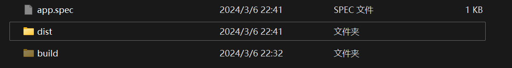

# python-script

本项目旨在制作和保存一些平时很有用的 `python`自动化脚本，以用来方便大家的使用。

## download

发行版本:[下载](https://github.com/ptsfdtz/useful-toolbox/releases/download/0.1.0/Toolbox-0.1.0-x86_64-pc-windows.zip)
源码:[下载](https://github.com/ptsfdtz/useful-toolbox/archive/refs/tags/0.0.4.zip)

## description

### 1. 发行版

如果你只是想使用这个工具箱的话，可以去下载发行版本：[下载链接](https://github.com/ptsfdtz/useful-toolbox/archive/refs/tags/0.0.4.zip)

下载完成后解压，会看到

打开 `dist` 文件夹运行 `app.exe` 即可。

### 2. 源码

如果你觉得发行版的文件太大了，你可以克隆本仓库。

```sh
git clone https://github.com/ptsfdtz/useful-toolbox.git
```

在文件夹中打开终端，安装`requirements`库。

```sh
pip install -r requirements.txt
```

使用只需要运行`app.py`文件。

## usage

1. 图片转 PDF
   
   选择一个你存储图片的文件夹，而不是单个图片，转换完成的 pdf 文件会在根目录。

2. 网络测速
   
3. 随机抽奖
   
   目前只适配姓名，可以选择人员名单，例如 excel 表格
   
   列的第一行需要是`姓名`
